<table style="border: none">
    <tr colspan=2>
        <h1 align=center>Stats</h1>
    </tr>
    <tr>
        <td></td>
        <td></td>
    </tr>
    <tr>
        <td></td>
        <td></td>
    </tr>
</table>